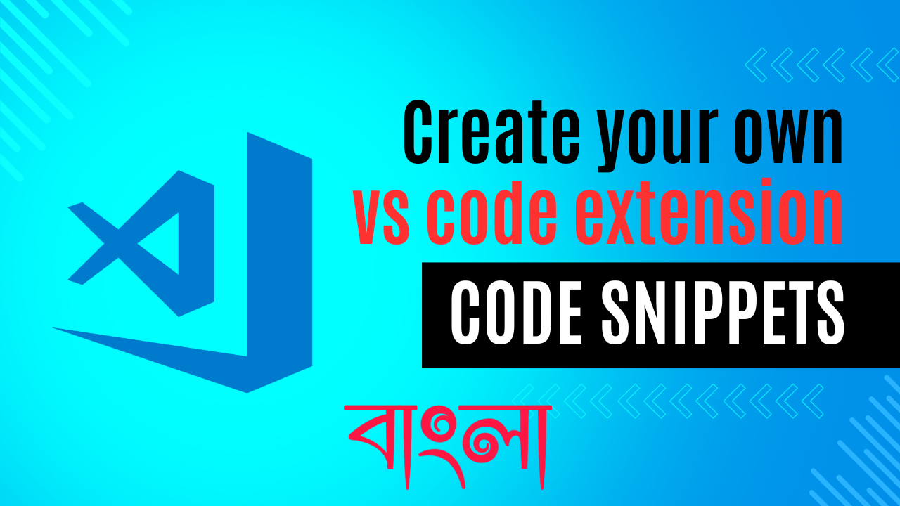

<p align="center">
  
</p>

# <center>Code Snippet<center>

This is a simple extension that provides code snippets for all programming
language and framwork. It helps to speed up the coding process by providing
handy snippets for commonly used code structures. It's easy to use and can be a
great tool for both beginners and experienced developers.

### Contributing tutorial (click and watch)
<a target="_blank" href="https://youtu.be/1m4XO19bZMU">
    
</a>

## Features

- HTML
  - HTML5 Boilerplate with JavaScript
- JavaScript
  - Console clear with a simple console log message

## Uses Resource

**ReactJS with TypeScript**

| No.                                     | Shortcut | Description |
| --------------------------------------- | -------- | ----------- |
| 0.1                                     | `!rafct` | It will     |
| create a arrow function with with types |

**JavaScript All Shortcut and description**

| No. | Shortcut  | Description                                                            |
| :-: | :-------: | :--------------------------------------------------------------------- |
| 01  | `jshello` | JavaScript Hello World Message with `console.clear()` method included! |

**Java Programming All Shortcut and description**

| No. | Shortcut  | Description                                           |
| :-: | :-------: | :---------------------------------------------------- |
| 01  | `!javaVH` | Java Hello World Program with matched file name class |

**HTML All Shortcut and description**

| No. | Shortcut  | Description                       |
| :-: | :-------: | :-------------------------------- |
| 01  | `html&js` | HTML5 Boilerplate with JavaScript |

## Contributing...

Since this package is fully open-source so, if you would like to contribute to
this project, please follow these steps:

1. Fork this repository.
2. Clone your forked repository.
3. For your changes.
4. Open `snippets` directory and if you want to add new **framework snippet**
   then create a new file like `snippets.java.snippets` or Make your changes,
   and commit them.
   - Remember, don't forget to added your language `id` inside this array
   ```js
   "snippets": [
      {
        "language": "html",
        "path": "./snippets/snippets.html-snippets"
      },
      {
        "language": "javascript",
        "path": "./snippets/snippets.javascript-snippets"
      }
    ]
   ```
5. If possible update `README.md` file based on your changes or new functions.
6. Push them to your forked repository:
7. Create a pull request on this repository.
8. Add a simple message which you made change or add on your pull request.
